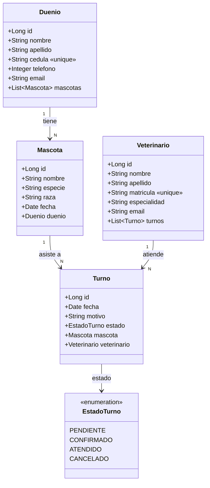

# Diagrama de clases — Dominio de la Clínica Veterinaria

Modelo de dominio del Sprint 1 (4 entidades + enum de estado).

## Relaciones

| Relación | Tipo | Anotación JPA |
|---|---|---|
| Dueño → Mascotas | 1 a N | `@OneToMany(mappedBy = "duenio")` en `Duenio` |
| Mascota → Dueño | N a 1 | `@ManyToOne` + `@JoinColumn(name = "duenio_id")` en `Mascota` |
| Turno → Mascota | N a 1 | `@ManyToOne` + `@JoinColumn(name = "mascota_id")` en `Turno` |
| Turno → Veterinario | N a 1 | `@ManyToOne` + `@JoinColumn(name = "veterinario_id")` en `Turno` |

La relación Mascota↔Veterinario es indirecta: se da **a través de Turno** (una mascota es atendida por un veterinario en un turno).
